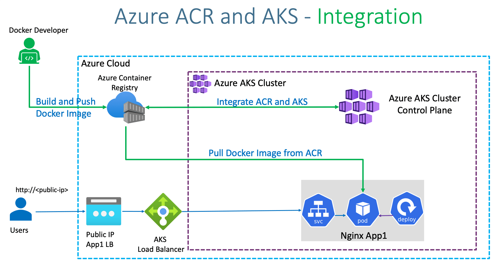
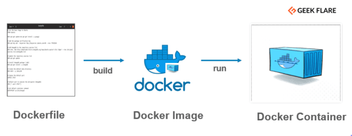

.. Dx29 v2 documentation master file, created by
   sphinx-quickstart on Tue Nov 23 09:30:21 2021.
   You can adapt this file completely to your liking, but it should at least
   contain the root `toctree` directive.
.. image:: images/All/Foundation29.png
   :width: 0px

.. image:: images/3_Environments/General/applicationPhases.jpg
   :width: 0px

.. image:: images/3_Environments/General/gitflow.jpg
   :width: 0px

.. image:: images/4_BuildAndDeploy/steps_ACR_AKS.png
   :width: 0px

.. image:: images/4_BuildAndDeploy/docker_acr.png
   :width: 0px

.. image:: images/4_BuildAndDeploy/aks_pipelines.png
   :width: 0px

.. image:: images/4_BuildAndDeploy/pipelines_1.png
   :width: 0px

.. image:: images/4_BuildAndDeploy/pipelines_2.png
   :width: 0px

.. image:: images/4_BuildAndDeploy/pipelines_3.png
   :width: 0px

.. image:: images/4_BuildAndDeploy/pipelines_4.png
   :width: 0px

.. image:: images/4_BuildAndDeploy/pipelines_5.png
   :width: 0px

.. image:: images/4_BuildAndDeploy/pipelines_test_1.png
   :width: 0px

.. image:: images/4_BuildAndDeploy/pipelines_test_2.png
   :width: 0px

.. image:: images/4_BuildAndDeploy/pipelines_test_3.png
   :width: 0px

.. image:: images/4_BuildAndDeploy/compose.png
   :width: 0px

.. image:: images/4_BuildAndDeploy/start_stop_aks.png
   :width: 0px  

.. image:: images/5_CodeGuidelines/codeguidelines_2.png
   :width: 0px 

.. image:: images/5_CodeGuidelines/codeguidelines_3.png
   :width: 0px 

.. image:: images/All/Foundation29.png
   :width: 100px
   :align: right
   :alt: Foundation29

Dx29 v2
===================================

**What is Dx29?**

Dx29 is a non-profit project to help patients and physicians understand the patient disease. It is a completely free software for analysis and management of your symptoms, creation and sharing of your medical history and help to reach a diagnosis.

If you already have a diagnosis, you will be able to generate your medical history and also keep up to date with clinical trials and patient groups of your disease.

The data in Dx29 can only be shared by its owner. Foundation 29 will never share it with anyone. In the future, we will include functionality so that patients can store their own data in their own private data space. 

**What is Foundation 29?**

We are a non-profit foundation. We work for a medicine in which empowered patients take control of their health through their data and work with doctors and institutions to improve their well-being and that of others.

We create technologies that allow a radical change in your capabilities as users and in the entire medical ecosystem.

The activism of patients, their families and associations are at our core. We put special focus on rare diseases. They are in our origin and in our name: February 29, world day of rare diseases.

Visit our `website`_.

.. _website: http://cnn.com/

**This document**

This document presents a technical description of the Dx29 software architecture.

.. toctree::
   :maxdepth: 2
   :caption: Dx29 v2

   pages/1_Architecture 
   pages/1_Architecture/SystemContext
   pages/1_Architecture/Containers
   pages/1_Architecture/Components
   pages/1_Architecture/Code  
   pages/2_DataModels
   pages/3_Environments
   pages/3_Environments/1_AKS-DEV
   pages/3_Environments/2_AKS-TEST
   pages/3_Environments/3_AKS-PRO
   pages/3_Environments/4_ScriptsCreateAndDeploy
   pages/4_BuildAndDeploy
   pages/4_BuildAndDeploy/1_Build
   pages/4_BuildAndDeploy/2_Deploy
   pages/4_BuildAndDeploy/3_Automation
   pages/4_BuildAndDeploy/4_Locally
   pages/4_BuildAndDeploy/5_CurrentStatus
   pages/5_CodeGuidelines
